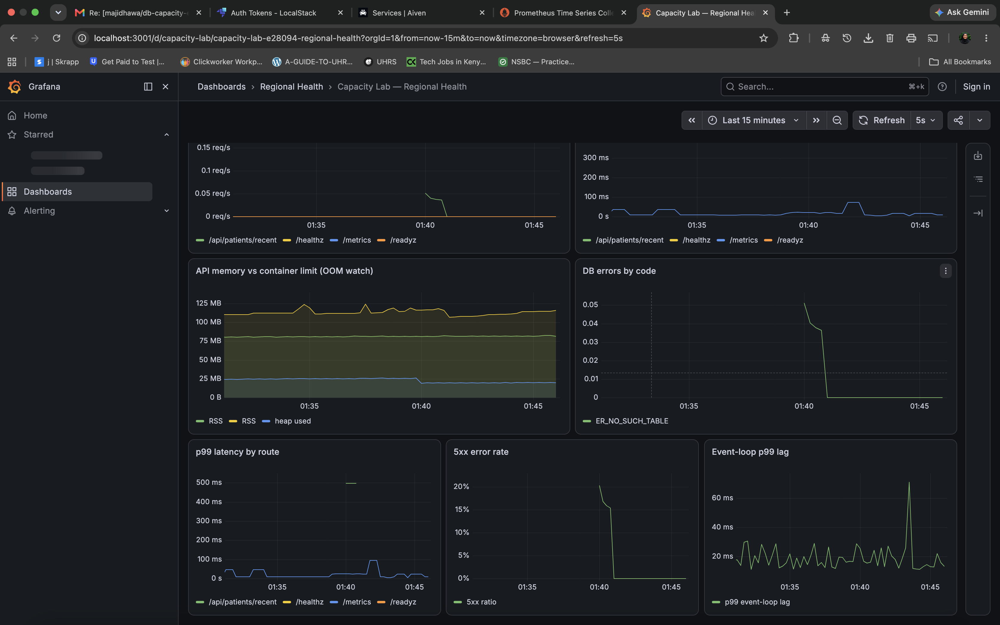
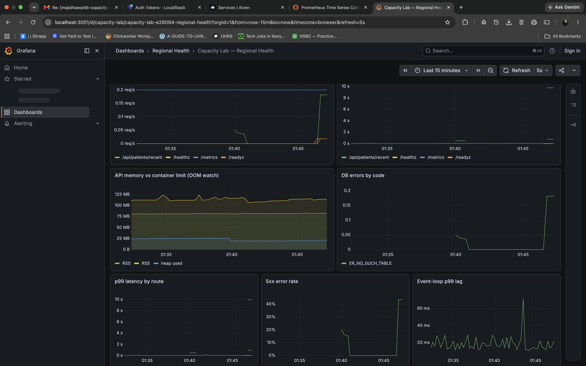
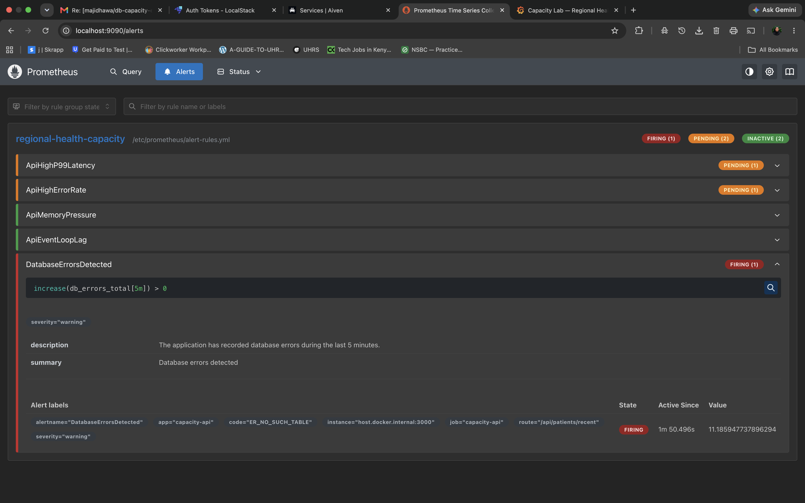
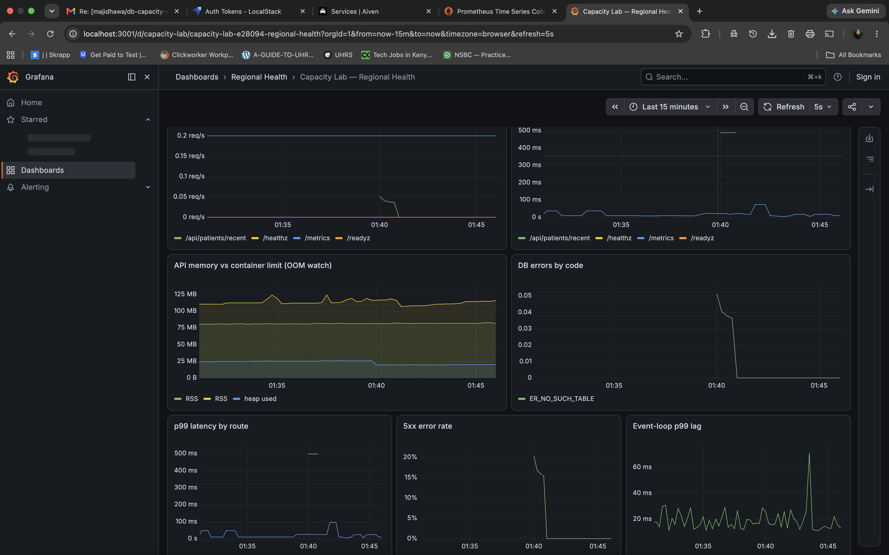

# C6 Observability Evidence

## Objective

Validate that the Regional Health application exposes useful operational
metrics, that Prometheus collects them, that Grafana visualizes them, and
that alert rules detect degraded behaviour.

## Healthy Baseline

The application runtime was healthy and connected to Aiven MySQL.

Prometheus successfully scraped the application's `/metrics` endpoint and
Grafana displayed live service behaviour including:

- request throughput;
- request latency;
- process and heap memory;
- database error activity;
- p99 latency;
- 5xx error rate;
- event-loop p99 lag.

Prometheus target state is preserved in:

`prometheus-targets-healthy.txt`

## Degraded Behaviour

A database-dependent request was exercised against the Aiven-backed runtime
and produced a real application/database error:

`ER_NO_SUCH_TABLE` — the `patients` table was not present in `defaultdb`.

The database connection itself remained reachable, which was confirmed by
`/readyz` returning HTTP 200.

The dashboard showed:

- increased database error activity;
- increased 5xx responses;
- latency degradation;
- continued application metric collection.

## Alert Validation

Prometheus was configured with alerts for:

- high p99 latency;
- elevated 5xx error rate;
- memory pressure;
- event-loop lag;
- database errors.

The `ER_NO_SUCH_TABLE` condition incremented `db_errors_total` and triggered
the `DatabaseErrorsDetected` alert.

The exact Prometheus rules used are preserved in:

`alert-rules.yml`

## Recovery

After the test traffic stopped, the database error alert cleared from the
active alert set. The application remained healthy throughout recovery:

- `/healthz` returned HTTP 200;
- `/readyz` returned HTTP 200;
- the database connection remained reachable.

The dashboard reflected the return toward the healthy baseline.

## Dashboard Definition

The Grafana dashboard used for this validation is preserved in:

`regional-health-dashboard.json`

## Result

The observability stack provides end-to-end visibility from application
metrics through Prometheus collection, PromQL evaluation, Grafana
visualization, and alert activation.

The implementation demonstrates the four primary operational signals:

- Traffic
- Latency
- Errors
- Saturation

It also includes leading indicators such as p99 request latency and
event-loop lag.
